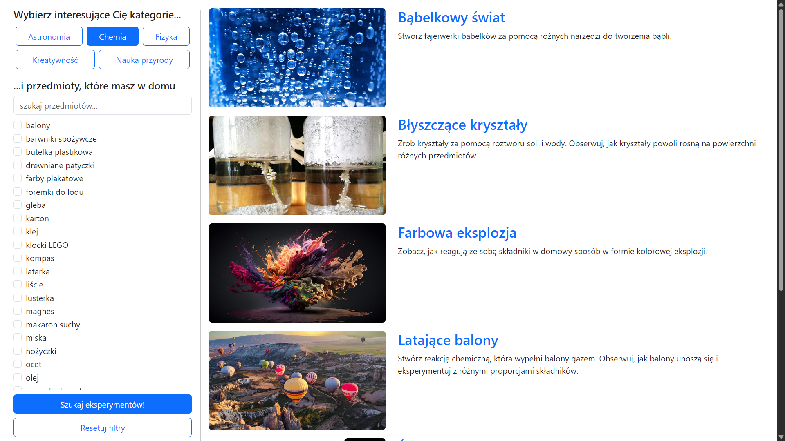
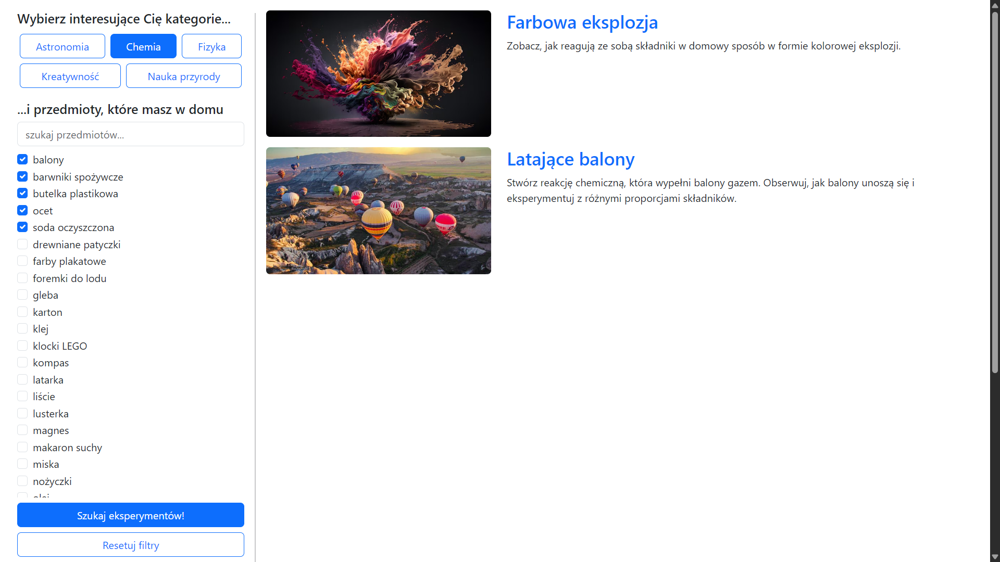
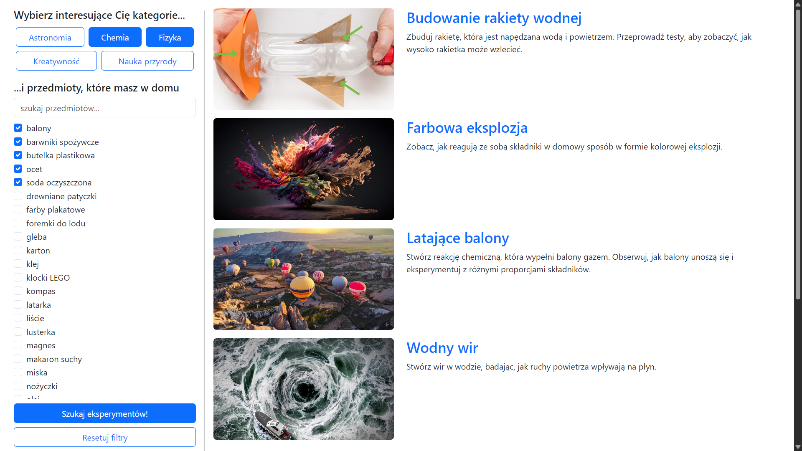
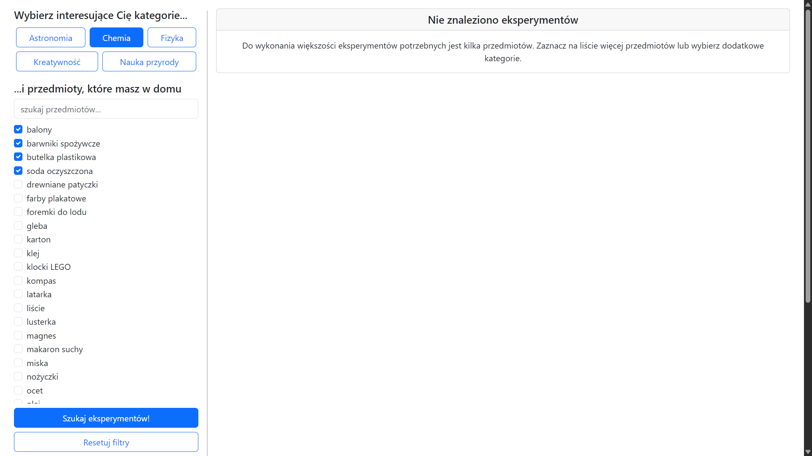

# Eksperymentopol

Web app for finding home science experiments by topic and household items.

Eksperymentopol helps users discover simple experiments that can be performed at home. Users can select science categories, mark items they already have, and search for matching experiments. Each experiment includes a short description, required materials and a detailed experiment page.

## Feature preview

### Browse experiments by category

The app allows users to filter experiments by topic, such as astronomy, chemistry, physics, creativity and natural science.

<p align="center">
  
</p>

### Filter by available household items

Users can narrow down results by selecting items they already have at home.

<p align="center">
  
</p>

### Combine multiple categories and items

The search supports combining category filters with item filters, making it possible to find experiments matching both interests and available materials.

<p align="center">
  
</p>

### Handle empty search results

When no experiment matches the selected filters, the app shows a clear empty-state message instead of an empty page.

<p align="center">
  
</p>

### View experiment details

Each experiment has a dedicated page with a description, required items and an embedded video.

<p align="center">
  
</p>

## What this project demonstrates

* full-stack web application development,
* server-side rendering with Flask templates,
* dynamic filtering with JavaScript,
* database-backed experiment, category and item models,
* many-to-many relationships between experiments, categories and required items,
* REST-like endpoints for search and filter data,
* clear empty-state handling,
* practical UI for browsing and discovering content.

## Repository structure

* `app.py` — Flask application and route definitions,
* `db_models.py` — SQLAlchemy database models,
* `db_init.py` — database initialization script,
* `experiments.json` — source data for experiments, categories and required items,
* `templates/` — HTML templates,
* `static/` — CSS, JavaScript and application assets,
* `docs/screenshots/` — screenshots used in this README,
* `setup.sh` — local setup helper.

## Running locally

```bash
./setup.sh
source .venv/bin/activate
python3 db_init.py
flask run
```

The application should then be available locally at:

```text
http://localhost:5000
```

## Technologies

* Python
* Flask
* SQLAlchemy
* SQLite
* JavaScript
* HTML / CSS

## Notes

This is a university coursework project, but it is presented here as a working educational web application. The focus is on experiment discovery, filtering logic, database-backed content and a simple user-facing interface.
